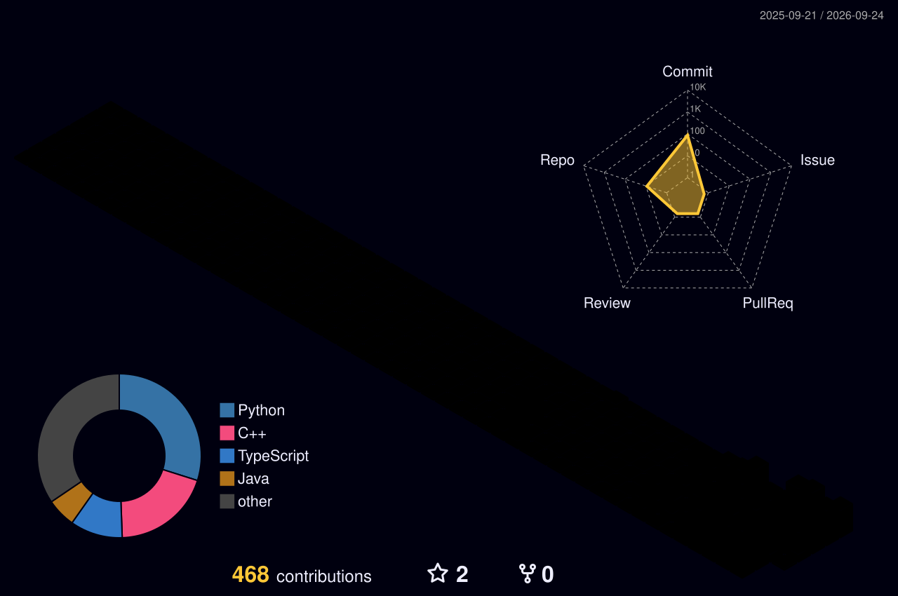

<!--
  ╔══════════════════════════════════════════════════════════════╗
  ║  3D ANIMATED GITHUB PROFILE README                           ║
  ╚══════════════════════════════════════════════════════════════╝
-->

<!-- ░░ LIVE WALLPAPER — animated wave header ░░ -->

  

<!-- ░░ LIVE TYPING ANIMATION ░░ -->

  

  
  

---

## 🧊 3D Contribution Skyline

<!-- Rendered nightly by the workflow in .github/workflows/profile-3d.yml -->

  

## 🐍 Contribution Snake

  

## 🌌 Animated Activity Wallpaper

  

## ⚡ Stats in Motion

  
  

  

## 🛠️ Stack

  

## 🎧 Now Playing

  

## 🔗 Connect

  

  

  

